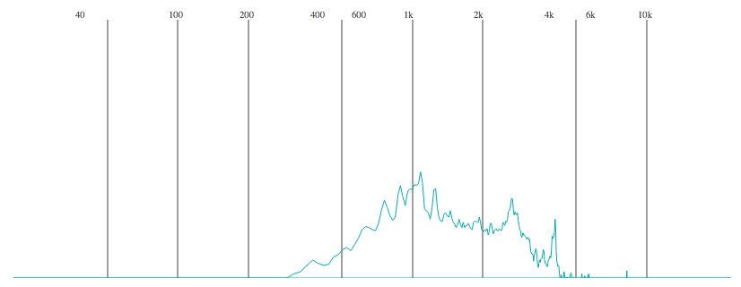

# React Frequency Meter



React Frequency Meter allows you to visualize frequencies in audio using [Web Audio Api](https://developer.mozilla.org/en-US/docs/Web/API/Web_Audio_API).


## Usage
Install via [npm](https://www.npmjs.com/):

```
$ npm install --save react-router
```

Then with a module bundler like [webpack](https://webpack.github.io/) that supports either CommonJS or ES2015 modules, use as you would anything else:

```js

// using an ES6 transpiler, like babel
import FrequencyMeter from 'react-fm';

// not using an ES6 transpiler
var FrequencyMeter = require('react-fm')

...

<FrequencyMeter
    audioContext={audioContext}
    audioSource={audioSource}
/>

```

You also need to include `lib/index.css` for styles.

Read [Web Audio Api Docs](https://developer.mozilla.org/en-US/docs/Web/API/Web_Audio_API)
to know about AudioContext and AudioSource.

## Examples
* Start the development server with `npm start`
* Point your browser to http://localhost:8080

See examples folder for complete examples.
